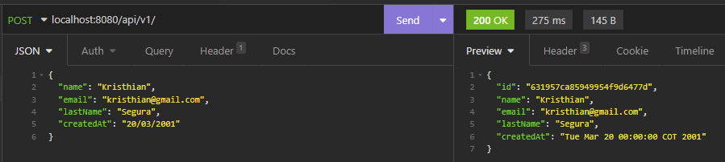
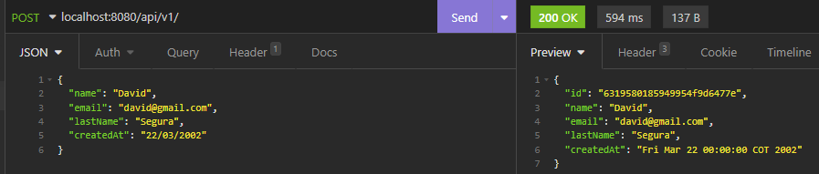
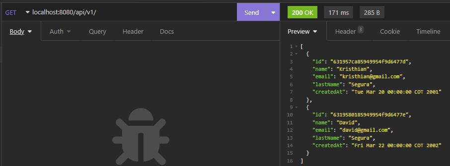
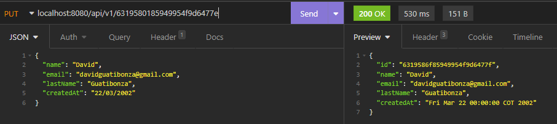
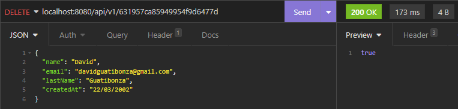
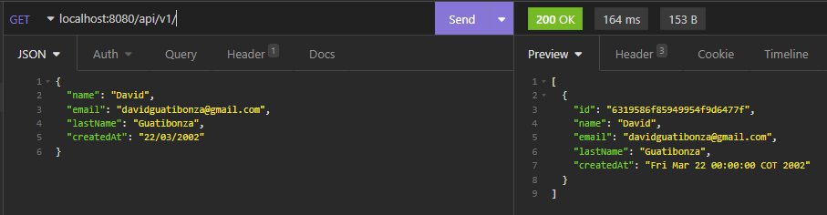

# Spring Boot Data with MongoDB

## Objectives

- Explain what MongoDB is.
- Explain the difference between SQL and NoSQL.
- Create a MongoDB Cluster on Atlas.
- Connect your Spring Boot project with a MongoDB Cluster.

## How to allow all IP addresses in a MongoDB database?

## Tests

### Create

### Get

### GetById

### Update

### Delete

